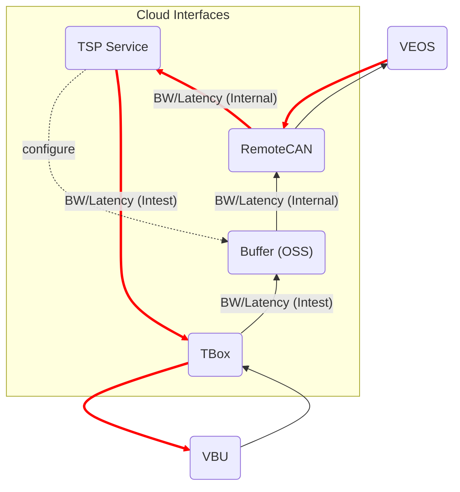

# Table of Contents

1.  [Preamble](#org6d57337)
2.  [Upload](#orgd2418a8)
    1.  [Raw streams](#org1aa46c6)
    2.  [Preprocessing](#org332c0a5)
3.  [Record](#orgb63a2c3)
    1.  [The structure of the record quadruple](#org50e5e97)
        1.  [$`s_t`$](#org6a33a23)
        2.  [$`s'_t`$](#org71a7f0b)
        3.  [$`a_t`$](#orgfdc18cc)
        4.  [$`r_t`$](#org10491a0)
4.  [Pool](#org91ce6ce)
    1.  [Pool](#org0edeb0a)
    2.  [Minibatch](#org7f4f4c3)
5.  [Dataflow](#org916db98)
    1.  [Upload (Observe)](#orgd7fa408)
    2.  [Download (flash)](#orgd41794f)
    3.  [Communication Performance Index](#org5e9fcf2)

# Preamble

This document serves as a README for VEOS ADP data interface. It covers the specification of data streams from receiving uploaded raw data streams, to pre-process the raw data to generate records, store records in a data pool, and finally to index and get minibatches for training purpose from the pool.

# Upload

## Raw streams

Raw streams are time series (****timestamped****) of raw observations (vehicle velocity, acceleration pedal opening, brake pedal opening, battery voltage, battery current) and actions (changed and flashed pedal map) occurring on the vehicle

## Preprocessing

Raw streams will be transformed into time stamped [Record](#orgb63a2c3) after preprocessing and stored in [Pool](#org91ce6ce).

# Record

-   Record is the uploading unit of remote-CAN module
-   It&rsquo;s a timestamped [quadruple](#orgb566816) (a tuple of 4 elements) $`(s_t, a_t, r_t, s'_t)`$ with a time stamp $`t`$
-   The sequence of records consist of an episode

## The structure of the record quadruple

<table border="2" cellspacing="0" cellpadding="6" rules="groups" frame="hsides">
<caption class="t-above">Table 1: The timestamped record</caption>

<colgroup>
<col  class="org-left" />

<col  class="org-left" />

<col  class="org-left" />

<col  class="org-left" />

<col  class="org-left" />
</colgroup>
<thead>
<tr>
<th scope="col" class="org-left">&#xa0;</th>
<th scope="col" class="org-left">$`s_t`$</th>
<th scope="col" class="org-left">$`a_t`$</th>
<th scope="col" class="org-left">$`r_t`$</th>
<th scope="col" class="org-left">$`s'_t`$</th>
</tr>
</thead>

<tbody>
<tr>
<td class="org-left">$`t`$ (timestamp)</td>
<td class="org-left">$`V_0`$, $`A_0`$, $`B_0`$</td>
<td class="org-left">&#xa0;</td>
<td class="org-left">&#xa0;</td>
<td class="org-left">$`V'_0`$, $`A'_0`$, $`B'_0`$</td>
</tr>

<tr>
<td class="org-left">&#xa0;</td>
<td class="org-left">$`V_1`$, $`A_1`$, $`B_1`$</td>
<td class="org-left">&#xa0;</td>
<td class="org-left">&#x2026;</td>
<td class="org-left">$`V'_1`$, $`A'_1`$, $`B'_1`$</td>
</tr>

<tr>
<td class="org-left">&#xa0;</td>
<td class="org-left">&#x2026;</td>
<td class="org-left">&#xa0;</td>
<td class="org-left">$`U_{r_0}`$, $`I_{r_0}`$</td>
<td class="org-left">&#xa0;</td>
</tr>

<tr>
<td class="org-left">&#xa0;</td>
<td class="org-left">&#x2026;</td>
<td class="org-left">&#xa0;</td>

<td class="org-left">&#x2026;</td>
<td class="org-left">&#xa0;</td>
</tr>

<tr>
<td class="org-left">&#xa0;</td>
<td class="org-left">$`V_k`$, $`A_k`$, $`B_k`$</td>
<td class="org-left">&#xa0;</td>
<td class="org-left">$`U_{r_k}`$, $`I_{r_k}`$</td>
<td class="org-left">$`V'_k`$, $`A'_k`$, $`B'_k`$</td>
</tr>

<tr>
<td class="org-left">&#xa0;</td>
<td class="org-left">&#x2026;</td>
<td class="org-left">&#xa0;</td>
<td class="org-left">&#x2026;</td>
<td class="org-left">&#x2026;</td>
</tr>

<tr>
<td class="org-left">&#xa0;</td>
<td class="org-left">$`V_{K-1}`$, $`A_{K-1}`$, $`B_{K-1}`$</td>
<td class="org-left">$`[PM_{5\times17}]^t`$</td>
<td class="org-left">$`U_{r_K}`$, $`I_{r_K}`$</td>
<td class="org-left">$`V'_{K-1}`$, $`A'_{K-1}`$, $`B'_{K-1}`$</td>
</tr>
</tbody>
</table>

### $`s_t`$

state at timestamp $`t`$

-   $`V_k`$: velocity of the vehicle
-   $`A_k`$: acceleration pedal position in percentage
-   $`B_k`$: brake pedal position in percentage
-   $`K`$: number of frames within a single record. A record starts from timestamp $`t`$, contains $`K`$ CAN frames and ends by the end of the last frame
    -   each line in a record is referred to as a single frame, whose information can be extracted from multiple CAN frames at the same moment
    -   rows within a record is contiguous in time starting from the timestamp $`t`$
    -   in case of frame loss, a loss token needs to be inserted as a lost frame state at the next timestamp of $`t`$, that is $`t+1`$

### $`s'_t`$

the next state following $`s_t`$

-   The state according to which the next decsion $`a_t`$ will be made.
-   In case of previous assumption, this state will contain the next adjacent 30 frames of state $`s_t`$.
-   $`s'_t`$ must be contiguous in time to $`s_t`$

### $`a_t`$

action at timestamp $`t`$

-   It&rsquo;s the decision of what pedal map will be applied after observing the state $`s_t`$ by the agent
-   The action $`a_t`$ of VEOS system is the pedal map $`[PM_{5\times17}]^t `$ at timestamp $`t`$. It&rsquo;s currently 5 consecutive rows in the full pedal map corresponding to the current state $`s_t`$, 17 is the current discretization level of the throttle pedal percentage. Each element of the pedal map is the requested torque given the vehicle velocity and the throttle pedal position
-   The real effective time of $`a_t`$ could be delayed by $`\Delta t`$ due to transmission and flashing latency, i.e. $`a_t`$ will be applied at $`t+\Delta t`$
-   $`a_t`$ must precede $`s'_t`$, that is $`t+\Delta t < t+1`$ so that the next state $`s'_t`$ is the result of applying $`a_t`$

### $`r_t`$

reward at timestamp $`t`$

-   It&rsquo;s the electricity consumption effected by the action $`a_t`$
-   It&rsquo;s computed by accumlating the product of battery voltage $`U_{r_k}`$ and current values $`I_{r_k}`$ at the frames after the current action $`a_t`$ is applied and before the next action $`a_{t+1}`$ becomes effective, that is to say, the voltage and current values after the moment $`r_0`$  when flashing the pedal map is done and in effect, until after the last effective moment $`r_K`$  when the next action $`a_{t+1}`$ is applied (flashed and in effect)

# Pool

## Pool

The pool is the aggregation of all the [records](#orgb63a2c3), ordered by timestamps

## Minibatch

A minibatch is a batch of [records](#orgb63a2c3) by random sampling the pool with designated batch size, see the following Python code snippet as an example for random sampling via `numpy.random.choice` API.

    import numpy as np
    
    #pool could be a python list containing all the records
    batch_size = 64
    index = np.random.choice(len(pool),batch_size)
    minibatch = pool(index)

# Dataflow

## Upload (Observe)

-   the arrows with black link
-   system state
    -   velocity
    -   battery voltage
    -   battery current
    -   acceleration pedal
    -   brake pedal
-   VBU parameters/Pedal Map(PM)

## Download (flash)

-   the arrow with red link
-   VBU parameter/Pedal Map(PM)

## Communication Performance Index

-   bandwidth: expected/upper bound/lowerbound for both Intest & Internal interface
-   latency: expected/upper bound/lowerbound for both Intest & Internal interface

