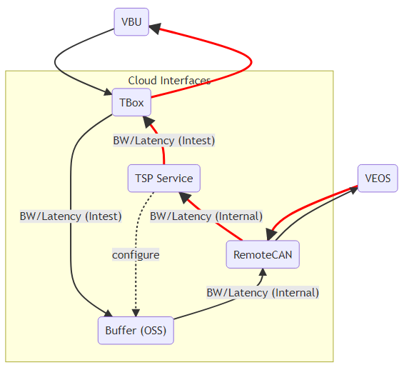

# Table of Contents

1.  [Release Notes](#org55f1255)
    1.  [eos 0.0.3](#org32542e4)
    2.  [current server list](#org199d3b4)
        1.  [remotecan servers](#org30227f6)
        2.  [trip control servers](#org28d7156)
        3.  [MongoDB servers:](#org0b64ba1)
    3.  [current vehicle list](#org6e61f91)
2.  [Preamble](#org60dcf7c)
3.  [Upload](#orgad26bca)
    1.  [Raw streams](#org6294fc6)
    2.  [Preprocessing](#org4b46585)
4.  [Record](#org3f1848f)
    1.  [It&rsquo;s a timestamped *quadruple*, which is a tuple of 4 elements $(s_t, a_t, r_t, s'_t)$ with a timestamp $t$](#orgf0182a0)
    2.  [The structure of the record](#org431d16f)
        1.  [$s_t$](#org56f7e77)
        2.  [$s'_t$](#org729ee16)
        3.  [$a_t$](#org181841b)
        4.  [$r_t$](#orgd3eccaf)
5.  [Episode](#org10ff81a)
6.  [Pool](#org0189634)
    1.  [Record pool](#orgef721f3)
        1.  [Record deposit interface](#org324760b)
        2.  [Record minibatch sample interface](#org93f10f1)
    2.  [Episode pool](#org46d30fe)
        1.  [Episode deposit interface](#orgdfa0083)
        2.  [Episode minibatch sample interface](#orga020e67)
7.  [Flashing](#org6c68dfd)
8.  [Dataflow](#org497822b)
    1.  [Upload (Observe)](#org2517082)
    2.  [Download (flash)](#orgec135a8)
    3.  [Communication Performance Index](#org30c787a)

# Release Notes

## eos 0.0.3

1.  fix cuda driver for tensorflow-gpu
2.  eos process ends elegantly
3.  server specification can take either names or urls. The list of current servers see below.
4.  add mongodb server option on the command line. Current interface example:
    
        python eos/realtime_train_infer_rdpg.py -v "VB1" -d "wangcheng" -m "can_cloud_svc" -w "rocket_cluster" -u "cloud" -o "mongo_local" -i
5.  update trip control client with ClearablePushConsumer
6.  build docker image with micromamba with changed docker hub image from micromamba

## current server list

### remotecan servers

<table border="2" cellspacing="0" cellpadding="6" rules="groups" frame="hsides">

<colgroup>
<col  class="org-left" />

<col  class="org-right" />

<col  class="org-right" />
</colgroup>
<thead>
<tr>
<th scope="col" class="org-left">Name</th>
<th scope="col" class="org-right">Host</th>
<th scope="col" class="org-right">Port</th>
</tr>
</thead>

<tbody>
<tr>
<td class="org-left">can_intra</td>
<td class="org-right">10.0.64.78</td>
<td class="org-right">5000</td>
</tr>

<tr>
<td class="org-left">can_cloud</td>
<td class="org-right">10.10.0.6</td>
<td class="org-right">30865</td>
</tr>

<tr>
<td class="org-left">can_cloud_svc</td>
<td class="org-right">remotecan.veos</td>
<td class="org-right">5000</td>
</tr>
</tbody>
</table>

### trip control servers

<table border="2" cellspacing="0" cellpadding="6" rules="groups" frame="hsides">

<colgroup>
<col  class="org-left" />

<col  class="org-right" />

<col  class="org-right" />
</colgroup>
<thead>
<tr>
<th scope="col" class="org-left">Name</th>
<th scope="col" class="org-right">Host</th>
<th scope="col" class="org-right">Port</th>
</tr>
</thead>

<tbody>
<tr>
<td class="org-left">rocket_intra</td>
<td class="org-right">10.0.64.78</td>
<td class="org-right">9876</td>
</tr>

<tr>
<td class="org-left">rocket_cloud</td>
<td class="org-right">10.0.64.122</td>
<td class="org-right">9876</td>
</tr>

<tr>
<td class="org-left">rocket_cluster</td>
<td class="org-right">10.10.0.13</td>
<td class="org-right">9876</td>
</tr>
</tbody>
</table>

### MongoDB servers:

<table border="2" cellspacing="0" cellpadding="6" rules="groups" frame="hsides">

<colgroup>
<col  class="org-left" />

<col  class="org-right" />

<col  class="org-right" />

<col  class="org-left" />

<col  class="org-left" />
</colgroup>
<thead>
<tr>
<th scope="col" class="org-left">Name</th>
<th scope="col" class="org-right">Host</th>
<th scope="col" class="org-right">Port</th>
<th scope="col" class="org-left">user</th>
<th scope="col" class="org-left">password</th>
</tr>
</thead>

<tbody>
<tr>
<td class="org-left">mongo_local</td>
<td class="org-right">127.0.0.1</td>
<td class="org-right">27017</td>
<td class="org-left">&#xa0;</td>
<td class="org-left">&#xa0;</td>
</tr>

<tr>
<td class="org-left">mongo_intra_sloppy</td>
<td class="org-right">10.0.64.64</td>
<td class="org-right">30116</td>
<td class="org-left">root</td>
<td class="org-left">Newrizon123</td>
</tr>

<tr>
<td class="org-left">mongo_cloud</td>
<td class="org-right">10.10.0.7</td>
<td class="org-right">30116</td>
<td class="org-left">&#xa0;</td>
<td class="org-left">&#xa0;</td>
</tr>

<tr>
<td class="org-left">mongo_cluster</td>
<td class="org-right">10.10.0.4</td>
<td class="org-right">23000</td>
<td class="org-left">admin</td>
<td class="org-left">ty02ydhVqDj3QFjT</td>
</tr>

<tr>
<td class="org-left">mongo_cluster_intra</td>
<td class="org-right">10.0.48.115</td>
<td class="org-right">23000</td>
<td class="org-left">admin</td>
<td class="org-left">ty02ydhVqDj3QFjT</td>
</tr>

<tr>
<td class="org-left">&#xa0;</td>
<td class="org-right">&#xa0;</td>
<td class="org-right">&#xa0;</td>
<td class="org-left">&#xa0;</td>
<td class="org-left">&#xa0;</td>
</tr>
</tbody>
</table>

## current vehicle list

<table border="2" cellspacing="0" cellpadding="6" rules="groups" frame="hsides">

<colgroup>
<col  class="org-left" />

<col  class="org-left" />
</colgroup>
<thead>
<tr>
<th scope="col" class="org-left">Name</th>
<th scope="col" class="org-left">VIN</th>
</tr>
</thead>

<tbody>
<tr>
<td class="org-left">VB7</td>
<td class="org-left">HMZABAAH7MF011058</td>
</tr>

<tr>
<td class="org-left">SU_BDC8937</td>
<td class="org-left">HMZABAAH4MF014497</td>
</tr>

<tr>
<td class="org-left">VB1</td>
<td class="org-left">HMZABAAH1MF011055</td>
</tr>

<tr>
<td class="org-left">VB4</td>
<td class="org-left">HMZABAAHXMF011054</td>
</tr>
</tbody>
</table>

# Preamble

This document serves as a README for VEOS ADP data interface. It covers the specification of data streams from receiving uploaded raw data streams, to pre-process the raw data to generate records, store records in a data pool, and finally to index and get minibatches for training purpose from the pool.

# Upload

## Raw streams

Raw streams are time series of raw observations (*timestamped* vehicle velocity, acceleration pedal opening, brake pedal opening, battery voltage, battery current) and actions (changed and flashed pedal map) applied on the vehicle.

## Preprocessing

Raw streams will be transformed into timestamped [Record](#org3f1848f) after preprocessing and stored in [Pool](#org0189634).

# Record

-   Record is the uploading unit of remote-CAN module

## It&rsquo;s a timestamped [*quadruple*](#org217e5b9), which is a tuple of 4 elements $(s_t, a_t, r_t, s'_t)$ with a timestamp $t$

-   A record without timestamp is called a quadruple
-   The sequence of records consist of an [*episode*](#org10ff81a)

## The structure of the record

<table border="2" cellspacing="0" cellpadding="6" rules="groups" frame="hsides">
<caption class="t-above">Table 1: The timestamped quadruple</caption>

<colgroup>
<col  class="org-left" />

<col  class="org-left" />

<col  class="org-left" />

<col  class="org-left" />

<col  class="org-left" />
</colgroup>
<thead>
<tr>
<th scope="col" class="org-left">&#xa0;</th>
<th scope="col" class="org-left">\(s_t\)</th>
<th scope="col" class="org-left">\(a_t\)</th>
<th scope="col" class="org-left">\(r_t\)</th>
<th scope="col" class="org-left">\(s'_t\)</th>
</tr>
</thead>

<tbody>
<tr>
<td class="org-left">\(t\) (timestamp)</td>
<td class="org-left">\(V_0\), \(A_0\), \(B_0\)</td>
<td class="org-left">&#xa0;</td>
<td class="org-left">&#xa0;</td>
<td class="org-left">\(V'_0\), \(A'_0\), \(B'_0\)</td>
</tr>

<tr>
<td class="org-left">&#xa0;</td>
<td class="org-left">\(V_1\), \(A_1\), \(B_1\)</td>
<td class="org-left">&#xa0;</td>
<td class="org-left">&#x2026;</td>
<td class="org-left">\(V'_1\), \(A'_1\), \(B'_1\)</td>
</tr>

<tr>
<td class="org-left">&#xa0;</td>
<td class="org-left">&#x2026;</td>
<td class="org-left">&#xa0;</td>
<td class="org-left">\(U_{r_0}\) , \(I_{r_0}\)</td>
<td class="org-left">&#xa0;</td>
</tr>

<tr>
<td class="org-left">&#xa0;</td>
<td class="org-left">&#x2026;</td>
<td class="org-left">&#xa0;</td>
<td class="org-left">&#x2026;</td>
<td class="org-left">&#xa0;</td>
</tr>

<tr>
<td class="org-left">&#xa0;</td>
<td class="org-left">\(V_k\), \(A_k\), \(B_k\)</td>
<td class="org-left">&#xa0;</td>
<td class="org-left">\(U_{r_k}\) , \(I_{r_k}\)</td>
<td class="org-left">\(V'_k\), \(A'_k\), \(B'_k\)</td>
</tr>

<tr>
<td class="org-left">&#xa0;</td>
<td class="org-left">&#x2026;</td>
<td class="org-left">&#xa0;</td>
<td class="org-left">&#x2026;</td>
<td class="org-left">&#x2026;</td>
</tr>

<tr>
<td class="org-left">&#xa0;</td>
<td class="org-left">\(V_{K-1}\), \(A_{K-1}\), \(B_{K-1}\)</td>
<td class="org-left">\([PM_{5\times17}]^t\)</td>
<td class="org-left">\(U_{r_K}\) , \(I_{r_K}\)</td>
<td class="org-left">\(V'_{K-1}\), \(A'_{K-1}\), \(B'_{K-1}\)</td>
</tr>
</tbody>
</table>

### $s_t$

state at timestamp $t$

-   $V_k$: velocity of the vehicle
-   $A_k$: acceleration pedal position in percentage
-   $B_k$: brake pedal position in percentage
-   $K$: number of frames within a single record. A record starts from timestamp $t$, contains $K$ CAN frames and ends by the end of the last frame
    -   each line in a record is referred to as a single frame, whose information can be extracted from multiple CAN frames at the same moment
    -   rows within a record is contiguous in time starting from the timestamp $t$
    -   in case of frame loss, a loss token needs to be inserted as a lost frame state at the next timestamp of $t$, that is $t+1$

### $s'_t$

the next state following $s_t$

-   The state according to which the next decsion $a_t$ will be made.
-   In case of previous assumption, this state will contain the next adjacent 30 frames of state $s_t$.
-   $s'_t$ must be contiguous in time to $s_t$

### $a_t$

action at timestamp $t$

-   It&rsquo;s the decision of what pedal map will be applied after observing the state $s_t$ by the agent
-   The action $a_t$ of VEOS system is the pedal map $[PM_{5\times17}]^t$ at timestamp $t$. It&rsquo;s currently 5 consecutive rows in the full pedal map corresponding to the current state $s_t$, 17 is the current discretization level of the throttle pedal percentage. Each element of the pedal map is the requested torque given the vehicle velocity and the throttle pedal position
-   The real effective time of $a_t$ could be delayed by $\Delta t$ due to transmission and flashing latency, i.e. $a_t$ will be applied at $t+\Delta t$
-   $a_t$ must precede $s'_t$, that is $t+\Delta t < t+1$ so that the next state $s'_t$ is the result of applying $a_t$

### $r_t$

reward at timestamp $t$

-   It&rsquo;s the electricity consumption effected by the action $a_t$
-   It&rsquo;s computed by accumlating the product of battery voltage $U_{r_k}$ and current values $I_{r_k}$ at the frames after the current action $a_t$ is applied and before the next action $a_{t+1}$ becomes effective, that is to say, the voltage and current values after the moment $r_0$  when flashing the pedal map is done and in effect, until after the last effective moment $r_K$  when the next action $a_{t+1}$ is applied (flashed and in effect)

# Episode

An episode is a consecutive sequence of [records](#org3f1848f) with a start and a termination state which typically represents a driving route/task or a test case and the vehicle operates on routinely.

-   **Triple**: Since the sequence is consecutive, the next state $s'_t$ is the next adjacent state $s_{t+1}$ and thus not required in the tuple. Therefore one record is reduced to a triple.
-   **Null elements**: Care needs to be taken to insert null elements in the sequence in case of absent records.
-   **Ragged**: $T$ is the total time steps of the episode. Episodes have different sequence length, since the termination of an episode could mean reaching the destination with different speeds or events. Therefore the [episode pool](#org799acda) is ususally ragged.

$e_T=[(s_0,a_0,r_0),(s_1,a_1,r_1), ...,(s_{T-1},a_{T-1},r_{T-1})]$

# Pool

The pool stores the experience history. It entails two kinds of forms: it stores either timestamped [records](#org3f1848f) which is called *record pool* or the whole sequence of records defined as [episodes](#org10ff81a) which is called *episode pool*.

## Record pool

The record pool is the aggregation of all the [records](#org3f1848f), ordered by timestamps. It has a *record deposit interface* to deposit a record of [quadruple](#org217e5b9) and a *record minibatch sample interface* to get a record minibatch of designated size randomly from the pool.

### Record deposit interface

The record deposit interface serves as the method to append a [record](#org3f1848f) in the pool. Please refer to the following Python code snippet.

    #pool could be a python list containing all the records
    pool.deposit_record(
    	(current_timestamp,
    	 state,
    	 action,
    	 reward,
    	 next_state,
    	 )
    )

### Record minibatch sample interface

A record minibatch is a batch of [records](#org3f1848f) by random sampling the record pool with designated batch size, see the following Python code snippet as an example for random sampling via `numpy.random.choice` API.

    import numpy as np
    
    #pool could be a python list containing all the records
    batch_size = 64
    index = np.random.choice(len(pool),batch_size)
    minibatch = pool(index)

## Episode pool

The episode pool is the aggregation of all the [episodes](#org10ff81a), ordered by timestamps of the episodes. It has an *episode deposit interface* to deposit an episode and an *episode minibatch sample interface* to get an episode minibatch of designated size randomly from the pool.

### Episode deposit interface

The episode deposit interface serves as the method to append a complete [episode](#org10ff81a) to the pool

    #pool could be a python list containing all the episodes
    #e_T is collected sequence of triples of an episode as defined above
    pool.deposit_episode(e_T)

### Episode minibatch sample interface

An episode minibatch is a batch of [episodes](#org10ff81a) by random sampling the episode pool with designated batch size, see the following Python code snippet as an example for random sampling via `numpy.random.choice` API.

    import numpy as np
    
    #pool could be a python list containing all the episodes
    batch_size = 64
    index = np.random.choice(len(pool),batch_size)
    minibatch = pool(index)

# Flashing

The flashing interface will take pedal-torque map data to be flashed on VBU. The interface took a list of pedal-torque map, the starting row index and the row number to be flashed. It returns the status code of the flashing. In case of success, the status code is 0, see the following Python code snippet:

    from typing import List
    import pandas as pd
    
    def send_pedaltorque_map(
    		pedaltorque_map: List[float],
    		starting_row: int,
    		row_num: int) -> int:
    
    	# implementation of remotecan flashing
    	returncode = 0 # 0 is success as defined by unix process
    
    	return returncode
    
    default_table_path = ".\somewhere.csv"
    pedaltorque_map = pd.read_csv(default_table_path).to_numpy()
    
    pedialtorque_map_list = pedaltorque_map.reshape(-1).tolist()
    #flashing the whole pedal map
    returncode = send_pedaltorque_map(pedaltorque_map, 0, 14)
    
    #flashing the 4 rows of pedal map, starting from 3rd row
    pedaltorque_map_3_7 = pedaltorque_map[3:7, :].reshape(-1).tolist()
    returncode = send_pedaltorque_map(pedaltorque_map_3_7, 3, 4)

# Dataflow

## Upload (Observe)

-   the arrows with black link
-   system state
    -   velocity
    -   battery voltage
    -   battery current
    -   acceleration pedal
    -   brake pedal
-   VBU parameters/Pedal Map(PM)
-   the communication should have flags START/STOP to enable streaming interface for the master on the cloud (VEOS), so that the master can get the full observation of an episode which is usually more than 20 seconds and can last over 10 miniutes.
    -   The master (VEOS) set START flag to start uploading,
    -   The mobile edge device (TBox) will upload observation data voluntarily and incessantly after receiving START flag and before STOP flag,
    -   The master (VEOS) set STOP flag to stop uploading,
    -   The mobile edge device (TBox) will stop uploading of observation immediately once it receives the STOP flag.

## Download (flash)

-   the arrow with red link
-   VBU parameter/Pedal Map(PM)

## Communication Performance Index

-   bandwidth: expected/upper bound/lowerbound for both Intest & Internal interface
-   latency: expected/upper bound/lowerbound for both Intest & Internal interface

